# Vaulty Interaction Diagrams

Visual representations of how Vaulty's context memory system works.

## 1. Overall System Flow

```mermaid
flowchart TD
    User["👤 USER<br/>'Write a Python script to process CSV'"]

    subgraph Claude["🤖 CLAUDE"]
        Step1["Step 1: Read .claude.md<br/>(trigger words & workflows)"]
        Step2["Step 2: ⚠️ CHECK CONFIG FIRST! ⚠️<br/>Read config.md for user preferences:<br/>• languages: Python<br/>• indent_size: 4<br/>• repos_directory: ~/code<br/>• test_framework_python: pytest"]
        Step3["Step 3: Identify trigger<br/>'Write' = Developer Agent workflow"]

        Step1 --> Step2
        Step2 --> Step3
    end

    Workflow["⚙️ AGENT WORKFLOW ACTIVATED"]

    subgraph Agents["Agent Pipeline"]
        Dev["Developer Agent"]
        Test["Tester Agent"]
        Audit["Auditor Agent"]
        Git["Git Agent"]

        Dev --> Test --> Audit --> Git
    end

    User --> Claude
    Step3 --> Workflow
    Workflow --> Agents

    style User fill:#e1f5ff
    style Claude fill:#fff4e1
    style Workflow fill:#e8f5e9
    style Agents fill:#f3e5f5
```

## 2. Detailed Agent Collaboration Workflow

```mermaid
flowchart TD
    UserReq["👤 USER REQUEST<br/>'Write a Python function to validate emails'"]

    subgraph DevAgent["💻 1. DEVELOPER AGENT"]
        DevRead["📖 Read Context:<br/>• config → language: Python, indent: 4<br/>• memory/architecture-design → patterns<br/>• memory/code-review → standards"]
        DevCode["✍️ Write Code:<br/>import re<br/>def validate_email(email: str) -> bool:<br/>    pattern = r'^[\\w\\.-]+@[\\w\\.-]+\\.\\w+$'<br/>    return bool(re.match(pattern, email))"]
        DevDone["✅ Code written"]

        DevRead --> DevCode --> DevDone
    end

    subgraph TestAgent["🧪 2. TESTER AGENT"]
        TestRead["📖 Read Context:<br/>• config → test_framework: pytest<br/>• config → minimum_coverage: 70%<br/>• memory/testing-qa → test standards"]
        TestCode["✍️ Write Tests:<br/>def test_validate_email_valid():<br/>    assert validate_email('user@example.com')<br/>def test_validate_email_invalid():<br/>    assert not validate_email('invalid')"]
        TestRun["▶️ Run tests → All pass, 85% coverage"]
        TestDone["✅ Tests pass"]

        TestRead --> TestCode --> TestRun --> TestDone
    end

    subgraph AuditAgent["🔍 3. AUDITOR AGENT"]
        AuditRead["📖 Read Context:<br/>• config → max_line_length: 100<br/>• config → linter: pylint<br/>• memory/code-review → security checklist"]
        AuditReview["🔎 Review Code:<br/>✓ No security issues<br/>✓ Code quality good<br/>✓ Tests adequate (>70%)<br/>✓ Follows code style (4-space indent)"]
        AuditDone["✅ AUDIT PASSED"]

        AuditRead --> AuditReview --> AuditDone
    end

    subgraph GitAgent["📦 4. GIT AGENT"]
        GitRead["📖 Read Context:<br/>• config → repos_directory: ~/code<br/>• config → default_branch: main<br/>• config → commit_style: conventional<br/>• memory/git-workflow → best practices"]
        GitOps["⚙️ Git Operations:<br/>$ cd ~/code/project<br/>$ git add validate_email.py test_validate_email.py<br/>$ git commit -m 'feat: Add email validation'<br/>$ git push -u origin feature/email-validation"]
        GitDone["✅ COMMITTED & PUSHED"]

        GitRead --> GitOps --> GitDone
    end

    Result["🎉 RESULT TO USER<br/><br/>✅ Feature implemented with tests<br/>✅ Code reviewed and approved<br/>✅ Committed to git<br/><br/>Files:<br/>• validate_email.py (implementation)<br/>• test_validate_email.py (85% coverage)<br/>• Committed to: feature/email-validation"]

    UserReq --> DevAgent
    DevDone --> TestAgent
    TestDone --> AuditAgent
    AuditDone --> GitAgent
    GitDone --> Result

    style DevAgent fill:#e3f2fd
    style TestAgent fill:#f3e5f5
    style AuditAgent fill:#fff3e0
    style GitAgent fill:#e8f5e9
    style Result fill:#c8e6c9
```

## 3. Configuration Flow Through System

```mermaid
flowchart TB
    Config["⚙️ config.md<br/>(User's Personal Settings)<br/><br/>name: 'John Developer'<br/>repos_directory: '~/code'<br/>default_branch: 'main'<br/>languages: [Python, JavaScript]<br/>indent_size: 4<br/>test_framework_python: 'pytest'<br/>minimum_coverage: 80<br/>cloud_provider: 'AWS'<br/>..."]

    Memory["📁 Memory Files"]
    Agents["🤖 Agents"]
    ClaudeMD["📋 .claude.md"]
    Claude["🧠 Claude"]

    Config --> Memory
    Config --> Agents
    Config --> ClaudeMD
    Config --> Claude

    subgraph MemoryDetails["Memory File Behavior"]
        MemRef["References config for standards"]
        MemEx["Example: git-workflow references:<br/>• default_branch<br/>• commit_style<br/>• git_workflow"]
        MemRef --> MemEx
    end

    subgraph AgentDetails["Agent Behavior"]
        AgentRef["References config for behavior"]
        AgentEx["Example: git-agent checks:<br/>• repos_directory<br/>• default_branch<br/>• commit_style"]
        AgentRef --> AgentEx
    end

    subgraph ClaudeDetails[".claude.md Behavior"]
        ClaudeRef["References config as priority #1"]
        ClaudeEx["⚠️ 'CHECK CONFIG FIRST!'"]
        ClaudeRef --> ClaudeEx
    end

    subgraph ClaudeAI["Claude AI Behavior"]
        ClaudeRead["Reads config first"]
        ClaudeUse["Uses user's preferences<br/>throughout interaction"]
        ClaudeRead --> ClaudeUse
    end

    Memory -.-> MemoryDetails
    Agents -.-> AgentDetails
    ClaudeMD -.-> ClaudeDetails
    Claude -.-> ClaudeAI

    style Config fill:#ffd54f,stroke:#f57f17,stroke-width:3px
    style Memory fill:#e1f5ff
    style Agents fill:#f3e5f5
    style ClaudeMD fill:#fff3e0
    style Claude fill:#c8e6c9
```

## 4. Memory Files & Agent Relationships

```mermaid
graph TB
    subgraph MemoryFiles["📚 MEMORY FILES<br/>(Best Practices)<br/><br/>Each references config for user preferences"]
        GitWF["📄 git-workflow.md"]
        ProjMgmt["📄 project-management.md"]
        TestQA["📄 testing-qa.md"]
        Deploy["📄 deployment.md"]
        Docs["📄 documentation.md"]
        CodeRev["📄 code-review.md"]
        Comm["📄 communication.md"]
        ArchDesign["📄 architecture-design.md"]
    end

    subgraph Agents["🤖 SPECIALIZED AGENTS<br/>(Each checks config first!)"]
        GitAgent["📦 Git Agent"]
        DevAgent["💻 Developer Agent"]
        TestAgent["🧪 Tester Agent"]
        AuditAgent["🔍 Auditor Agent"]
        DeployAgent["🚀 Deployment Agent"]
        PMAgent["📊 Project Mgr Agent"]
        DocsAgent["📝 Documentation Agent"]
        DebugAgent["🐛 Debugger Agent"]
    end

    GitWF -.->|Referenced by| GitAgent

    ArchDesign -.->|Referenced by| DevAgent
    CodeRev -.->|Referenced by| DevAgent

    TestQA -.->|Referenced by| TestAgent

    CodeRev -.->|Referenced by| AuditAgent
    TestQA -.->|Referenced by| AuditAgent

    Deploy -.->|Referenced by| DeployAgent

    ProjMgmt -.->|Referenced by| PMAgent

    Docs -.->|Referenced by| DocsAgent

    Comm -.->|Referenced by| DebugAgent

    style MemoryFiles fill:#e8f5e9
    style Agents fill:#e3f2fd
    style GitWF fill:#fff9c4
    style ProjMgmt fill:#fff9c4
    style TestQA fill:#fff9c4
    style Deploy fill:#fff9c4
    style Docs fill:#fff9c4
    style CodeRev fill:#fff9c4
    style Comm fill:#fff9c4
    style ArchDesign fill:#fff9c4
```

## 5. Quick Example Interactions

### Example A: "Commit these changes"

```mermaid
flowchart TD
    User["👤 User: 'Commit these changes'"]
    Read["🤖 Claude reads .claude.md"]
    Trigger["🎯 Trigger: 'commit' → Git Agent"]

    subgraph GitAgent["📦 Git Agent"]
        Step1["1️⃣ Read config.md<br/>→ repos_directory, default_branch, commit_style"]
        Step2["2️⃣ Read memory/git-workflow.md<br/>→ best practices"]
        Step3["3️⃣ Run: git status, git diff"]
        Step4["4️⃣ Create commit message<br/>(conventional style from config)"]
        Step5["5️⃣ Commit and push"]

        Step1 --> Step2 --> Step3 --> Step4 --> Step5
    end

    Done["✅ Done!"]

    User --> Read --> Trigger --> GitAgent --> Done

    style User fill:#e1f5ff
    style GitAgent fill:#e8f5e9
    style Done fill:#c8e6c9
```

### Example B: "Deploy to production"

```mermaid
flowchart TD
    User["👤 User: 'Deploy to production'"]
    Read["🤖 Claude reads .claude.md"]
    Trigger["🎯 Trigger: 'deploy' → Deployment Agent"]

    subgraph DeployAgent["🚀 Deployment Agent"]
        Step1["1️⃣ Read config.md<br/>→ cloud_provider: AWS, environments"]
        Step2["2️⃣ Read memory/deployment.md<br/>→ deployment checklist"]
        Step3["3️⃣ Run pre-deployment checks"]
        Step4["4️⃣ Deploy to AWS<br/>using user's CI/CD pipeline"]
        Step5["5️⃣ Monitor deployment"]

        Step1 --> Step2 --> Step3 --> Step4 --> Step5
    end

    Done["✅ Done!"]

    User --> Read --> Trigger --> DeployAgent --> Done

    style User fill:#e1f5ff
    style DeployAgent fill:#fff3e0
    style Done fill:#c8e6c9
```

### Example C: "Fix this bug"

```mermaid
flowchart TD
    User["👤 User: 'The login function isn't working'"]
    Read["🤖 Claude reads .claude.md"]
    Trigger["🎯 Trigger: 'bug' → Debugger Agent"]

    subgraph DebugAgent["🐛 Debugger Agent"]
        D1["1️⃣ Read config.md<br/>→ workspace, languages"]
        D2["2️⃣ Investigate in user's<br/>workspace directory"]
        D3["3️⃣ Find root cause"]
        D1 --> D2 --> D3
    end

    Handoff1["🤝 Hands off to Developer Agent"]

    subgraph DevAgent["💻 Developer Agent"]
        Dev1["1️⃣ Read config.md<br/>→ code style preferences"]
        Dev2["2️⃣ Fix the bug"]
        Dev1 --> Dev2
    end

    Handoff2["🤝 Hands off to Tester Agent"]

    subgraph TestAgent["🧪 Tester Agent"]
        T1["1️⃣ Read config.md<br/>→ test framework"]
        T2["2️⃣ Add regression test"]
        T1 --> T2
    end

    Handoff3["🤝 Hands off to Auditor Agent"]

    subgraph AuditAgent["🔍 Auditor Agent"]
        A1["1️⃣ Review fix"]
    end

    Handoff4["🤝 If PASS, hand off to Git Agent"]

    subgraph GitAgent["📦 Git Agent"]
        G1["1️⃣ Read config.md<br/>→ git preferences"]
        G2["2️⃣ Commit the fix"]
        G1 --> G2
    end

    Done["✅ Done!"]

    User --> Read --> Trigger --> DebugAgent
    DebugAgent --> Handoff1 --> DevAgent
    DevAgent --> Handoff2 --> TestAgent
    TestAgent --> Handoff3 --> AuditAgent
    AuditAgent --> Handoff4 --> GitAgent
    GitAgent --> Done

    style User fill:#e1f5ff
    style DebugAgent fill:#ffebee
    style DevAgent fill:#e3f2fd
    style TestAgent fill:#f3e5f5
    style AuditAgent fill:#fff3e0
    style GitAgent fill:#e8f5e9
    style Done fill:#c8e6c9
```

## Key Takeaways

1. **Config First**: Every operation starts by checking user's config
2. **Memory Files**: Provide best practices for each domain
3. **Agents**: Specialized experts that reference config + memory
4. **Workflows**: Agents collaborate (Developer → Tester → Auditor → Git)
5. **Personalized**: Everything adapts to YOUR tools, style, and workflow

---

*This is a living document. As you use Vaulty, you'll see these patterns in action!*
